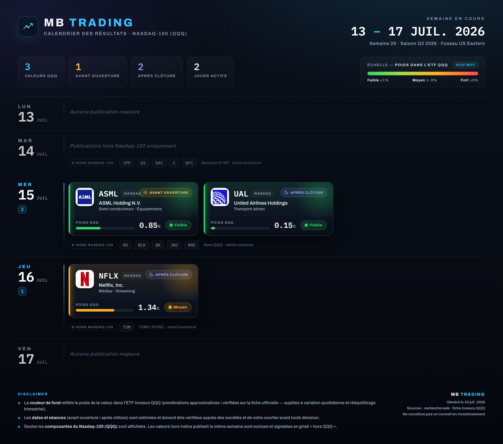

# MB TRADING — Calendrier hebdomadaire des résultats QQQ

Génère une **image dashboard** (PNG) des sociétés du **Nasdaq-100 (ETF Invesco QQQ)**
qui publient leurs résultats pour la semaine en cours, avec code couleur heatmap selon
le poids dans l'ETF.



## Ce que produit l'outil

- En-tête **MB TRADING** + plage de dates de la semaine.
- Regroupement **par jour** (lundi → vendredi) avec la **séance** (avant ouverture / après clôture).
- **Logos** récupérés par recherche d'image (favicons officiels), avec **fallback monogramme** coloré.
- **Heatmap** : couleur de fond de chaque société = son poids dans le QQQ
  (Faible < 1 % vert · Moyen 1–3 % ambre · Fort > 3 % rouge) + légende.
- Valeurs **hors Nasdaq-100** publiant la même semaine (banques NYSE, TSMC…) affichées en
  grisé « ⊘ hors QQQ » et rappelées dans le **disclaimer**.

## Workflow hebdomadaire (routine automatique du dimanche soir)

Chaque dimanche, une session régénère l'image pour la semaine à venir :

1. **Recherche web à jour** des sociétés publiant cette semaine (calendrier des résultats).
2. **Filtrage** sur les seules composantes du QQQ ; les autres sont notées en « hors QQQ ».
3. **Vérification des pondérations** sur la fiche officielle Invesco QQQ / stockanalysis.
4. Mise à jour de **`week-data.json`** avec les données de la semaine.
5. `node generate.mjs` → rend et recadre l'image → envoi à l'utilisateur.

## Utilisation manuelle

```bash
node generate.mjs --data week-data.json --out mb_trading_calendrier.png
```

Variables/prérequis :
- **node** (≥ 18), un binaire **Chromium** (auto-détecté sous `/opt/pw-browsers/…`,
  sinon définir `CHROME=/chemin/vers/chrome`).
- **python3 + Pillow** pour le recadrage (auto-installé si absent).
- Accès réseau sortant (récupération des logos + polices déjà embarquées dans `fonts-embedded.css`).

## Schéma de `week-data.json`

```jsonc
{
  "weekRange": "13&nbsp;<em>–</em>&nbsp;17 JUIL. 2026",   // plage affichée (em = accent cyan)
  "weekMeta":  "Semaine 29 · Saison Q2 2026 · Fuseau US Eastern",
  "generated": "16 juil. 2026",
  "days": [
    {
      "d": "MER", "date": "15", "mon": "JUIL",
      "note": "…",                 // texte si aucune valeur QQQ ce jour (optionnel)
      "qqq": [                       // composantes QQQ du jour
        {
          "ticker": "ASML",
          "name": "ASML Holding N.V.",
          "sector": "Semi-conducteurs · Équipements",
          "weight": 0.85,           // poids QQQ en % -> pilote la heatmap
          "brand": "#0a5cb8",       // couleur du monogramme de secours
          "domain": "asml.com",     // domaine pour récupérer le logo
          "session": "bmo"          // "bmo" = avant ouverture, "amc" = après clôture
        }
      ],
      "ghost": ["MS", "BLK"],        // tickers hors QQQ publiant le même jour
      "ghostNote": "Hors QQQ · même semaine"
    }
  ]
}
```

Les KPI (nb de valeurs QQQ, avant ouverture, après clôture, jours actifs) sont calculés
automatiquement depuis `days`.

## Note

Outil d'illustration : dates/horaires estimés et à vérifier, pondérations approximatives
(variation quotidienne + rééquilibrage trimestriel). **Ne constitue pas un conseil en investissement.**
