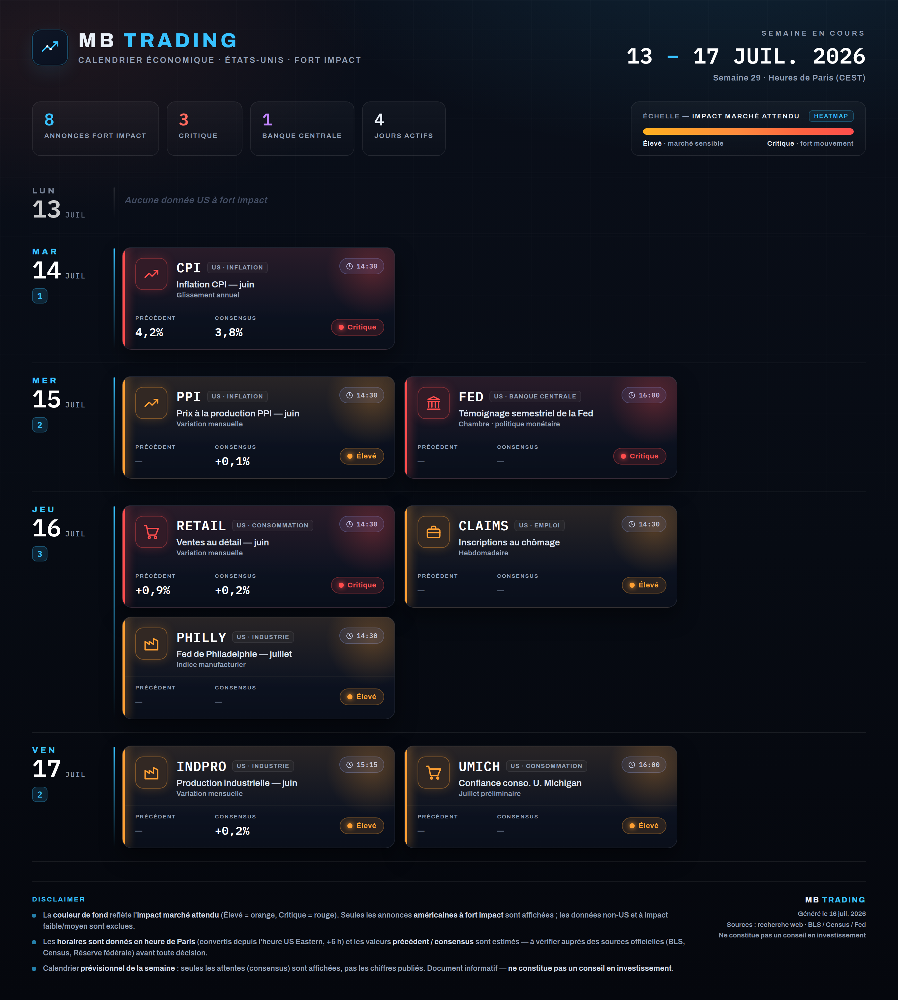

# MB TRADING — Calendrier économique hebdomadaire (États-Unis · fort impact)

Génère une **image dashboard** (PNG) des **annonces macro américaines à fort impact**
de la semaine, même charte que le calendrier des résultats QQQ.



## Périmètre

- **États-Unis uniquement.** Aucune donnée non-US.
- **Fort impact uniquement** : CPI, PPI, PCE, NFP/emploi, décisions & prises de parole
  de la Fed, ventes au détail, ISM, PIB, inscriptions au chômage, confiance conso, etc.
  Les publications à impact faible/moyen sont exclues.

## Lecture

- Regroupement **par jour** (lundi → vendredi), **horaires affichés en heure de Paris** (le générateur convertit automatiquement les heures saisies en US Eastern, +6 h).
- Chaque carte : code + catégorie, intitulé, heure, **Précédent / Consensus** et **pastille d'impact**.
- Vue **prévisionnelle** : les chiffres publiés (résultats à la sortie) ne sont pas affichés — à poster en amont de la semaine.
- **Heatmap = impact marché attendu** : Élevé (orange) → Critique (rouge). Légende incluse.

## Utilisation

```bash
node generate.mjs --data week-data.json --out mb_trading_econ.png
```

Prérequis identiques au calendrier QQQ (node, Chromium auto-détecté, Pillow auto-installé).

## Schéma de `week-data.json`

```jsonc
{
  "weekRange": "13&nbsp;<em>–</em>&nbsp;17 JUIL. 2026",
  "weekMeta":  "Semaine 29 · Heures de Paris (CEST)",
  "generated": "16 juil. 2026",
  "days": [
    {
      "d": "MAR", "date": "14", "mon": "JUIL",
      "note": "…",                 // texte si aucune annonce ce jour (optionnel)
      "events": [
        {
          "code": "CPI",
          "cat": "inflation",       // inflation | fed | conso | emploi | industrie
          "name": "Inflation CPI — juin",
          "detail": "Glissement annuel · publié",
          "time": "08:30 ET",
          "impact": "critique",     // "critique" (rouge) | "eleve" (orange)
          "prev": "4,2%",           // précédent (ou "—")
          "cons": "3,8%"            // consensus (ou "—")
        }
      ]
    }
  ]
}
```

Les KPI (nombre d'annonces, dont critiques, banque centrale, jours actifs) sont calculés
automatiquement.

## Note

Horaires et valeurs **estimés/à vérifier** (BLS, Census, Réserve fédérale).
**Ne constitue pas un conseil en investissement.**
